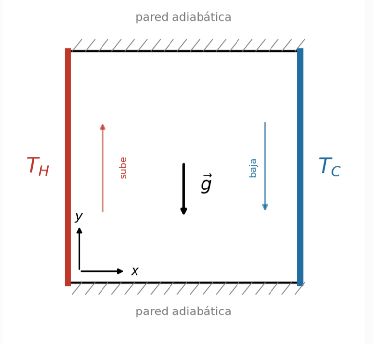
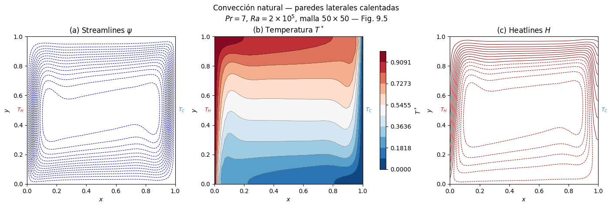
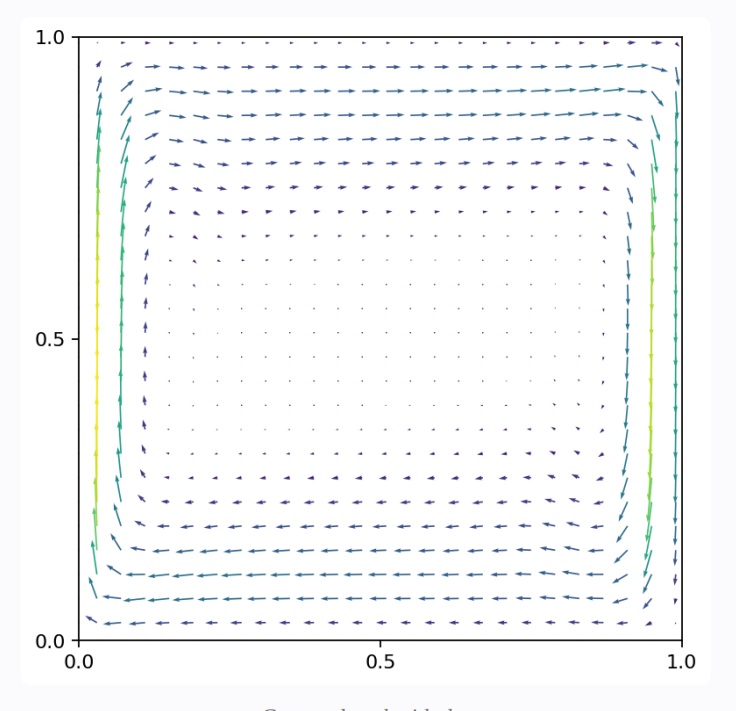

## Introducción

Todos de una u otra manera hemos experimentado este fenomeno, un ejemplo en el que podemos pensar es si ponemos una olla con agua fría junto a una ventana que pueda entrar el sol, después de un tiempo si tocamos sus dos costados: uno estará tibio y el otro no. Es como pueden pensar la simulación. Entonces físicamente lo que pasa es que el fluido junto a la pared caliente se expande, se vuelve menos denso y empieza a querer flotar; el fluido junto a la pared fría se contrae y se hunde. Esto provocará un movimiento en el fluido, ya que al alejarse de las paredes cambia su temperatura, pero ahora el fluido que esta en las paredes se quiere mover en la forma en la que ya dijimos, por lo que empieza un movimiento llamado convección natural, y es el mecanismo detrás de las brisas marinas, la circulación del manto terrestre y hasta del patrón de las manchas solares.

En mi simulación, es el caso clásico: una cavidad cuadrada cuya pared izquierda se mantiene caliente ($T_H = 1$), la derecha fría ($T_C = 0$), y las paredes horizontales son adiabáticas (no dejan pasar calor). El fluido parte del reposo absoluto con el efecto de la gravedad, entonces ¿cómo nace la circulación y cómo se ve el estado final?

### Las ecuaciones

El problema está gobernado por tres leyes de conservación acopladas, escritas aquí en forma adimensional bajo la aproximación de Boussinesq, esta aproximación nos dice que la densidad solo varía con la temperatura, y esa variación solo modificará el valor de la flotabilidad. 

**Conservación de masa (continuidad):**
$$
\nabla \cdot \vec{u} = 0
$$
El fluido es incompresible: lo que entra a cualquier volumen, sale. No existen fuentes ni sumideros.

**Conservación de momento (Navier–Stokes + Boussinesq):**
$$
\underbrace{\frac{\partial \vec{u}}{\partial t}}_{\text{aceleración local}}
+ \underbrace{(\vec{u}\cdot\nabla)\vec{u}}_{\text{advección}}
= \underbrace{-\nabla p}_{\text{presión}}
+ \underbrace{\frac{1}{Re}\nabla^2\vec{u}}_{\text{difusión viscosa}}
+ \underbrace{Pr\, T\, \hat{\jmath}}_{\text{flotabilidad}}
$$
Es la segunda ley de Newton para un fluido. De izquierda a derecha. Es la aceleración local mas a advección, que iguala a la fuerza de presión mas la fricción viscosa mas la flotabilidad de Boussinesq. 

**Conservación de energía:**
$$
\frac{\partial T}{\partial t} + \vec{u}\cdot\nabla T = \frac{1}{Re\,Pr}\nabla^2 T
$$

El acoplamiento es el corazón del problema, la temperatura genera movimiento a través de la flotabilidad (segunda ecuación), y el movimiento redistribuye la temperatura a través de la advección (tercera ecuación). Que sean ecuaciones acopladas significa que no se puede resolver una sin la otra, por lo que una solución análitica es practicamente imposible. Aunque por medio de aproximaciones computacionales y soluciones numéricas, podemos llegar a una solución. 

### Los números que mandan

Tenemos dos parámetros adimensionales que controlan todo el comportamiento:

- **Número de Prandtl**, $Pr = \nu/\alpha = 7$: Este número representa qué tan rápido se difunde el momento (viscosidad) del fluido frente al calor. Para este caso se ocupo el valor de $Pr = 7$ que corresponde al agua.
- **Número de Rayleigh**, $Ra = \dfrac{g\beta \Delta T L^3}{\nu\alpha} = 2\times10^5$: Este es responsable que mide qué tan fuerte es el empuje de flotabilidad frente a los frenos difusivos. Mide la intensidad de la convección. A $Ra$ bajo el calor se transporta por pura conducción; a $Ra$ alto, hay mucho movimiento y la convección domina para distribuir el calor.

De ellos se deriva el número de Reynolds efectivo de la formulación, $Re = \sqrt{Ra/Pr} \approx 169$. Que es el cociente entre las fuerzas inerciales y viscosas.

## Metodología

Resolví las ecuaciones en **Fortran** con el **método de proyección de Chorin** sobre una **malla escalonada de $50\times50$** volúmenes finitos:

1. **Predicción:** se avanzan las velocidades con advección, difusión y flotabilidad, ignorando la presión.
2. **Proyección:** se resuelve una ecuación de Poisson para la presión (solver iterativo línea por línea con TDMA) que fuerza $\nabla\cdot\vec{u}=0$.
3. **Corrección:** se corrigen las velocidades con el gradiente de presión.
4. Se transporta la temperatura con el campo de velocidad ya corregido.

El paso de tiempo es $\Delta t^* = 5\times10^{-5}$, muy por debajo del límite CFL ($\approx 0.02$), y la simulación corre desde el reposo hasta $t^* = 60$, guardando un cuadro cada $\Delta t^* = 0.25$ para la animación.

Además de temperatura, velocidad y **líneas de corriente** ($\psi$, que dibujan por dónde circula la masa), calculé las **heatlines** o líneas de calor: la función de calor
$$
H(x,y) = \int_0^y \left( uT - \frac{1}{Re\,Pr}\frac{\partial T}{\partial x} \right) dy'
$$
cuyos contornos dibujan por dónde viaja la **energía** — el análogo térmico exacto de las líneas de corriente (Kimura & Bejan, 1983). Donde el fluido está quieto, las heatlines son perpendiculares a las isotermas (pura conducción); donde hay flujo, se doblan y siguen al fluido.

## Resultados y discusión

En la primera imagen, vemos 3 figuras. La primera de izquiera a derecha son las lineas de corriente, estas lineas nos muestran el camino en el que el agua va a tomar a forma en la que se va moviendo en la cavidad, aqui se observa que si es una celda convectiva, ya que podemos observar dos vórtices combinados en la cavidad, centrados pero uno cerca de la pared fria y otro cera de la pared caliente. Entre mas lejos y cerca de las paredes se encuentre una particula, más se va a mover a traves de la cavidad. Tambie se nota la alta densidad de lineas de corriente cerca de las paredes laterales, lo que significa que en ese punto el flujo es mas rápido. 

La de siguente figura, la de en medio, se trata sobre las isotérmas, donde la temperatura es constante. Es claro como conforme el fluido se va al centro, las isotérmas se vuelvel horizontales. Se vuelven estáticas, el fluido caliente se mantiene arriba y el frio se mantiene abajo. En los laterales las isotérmas son verticales y muy juntas, por lo que el mayor intercambio de calor se da en estas zonas, también notamos como en el centro practicamente no hay cambios de temperatura, ni se calienta ni se enfria el liquido.

Por último, observamos las lineas de calor, estas son como viaja el calor a traves del liquido, se observa como las lineas "nacen" de la pared caliente, suben a la parte superior y terminan en la pared fria, algunas lineas, las mas alejadas de las paredes se observan que continuan girando, como si los vortices los atraparan. Si tuvieramos un valor de Rayleigh bajo, el calor cruzaria horizontalemnte la cavidad. 

Notamos que las 3 figuras se relacionan entre si, se entienden mejor observando las 3, en las 3 se observa claramente los 2 vórtices centrales, las isotérmicas y las lineas de calor muestran como el calor sube. Y como es un movimiento cíclico. Las 3 figuras muestran el mismo fenomeno acoplado.

Tambien, sumando una figura más que ayuda a completar el comportamiento del fluido es la que se muestra abajo. Es el campo de velocidades, y una vez más, notamos como se complementa con las 3 figuras anteriores vistas. Donde la parte donde más rápido se mueve el líquido es en las paredes laterales, donde está mas caliente o más fría. En la parte superior e inferior se reduce la velocidad del movimiento del liquido. En el centro, donde corresponde el lugar de los vertices o donde no hay intercambio de calor. La velocidad es practicamente nula.

Se hizo una animación sobre las imagenes pasadas para poder observar como se desarrolla el sistema a través del tiempo, desde el momento donde empieza el movimiento hasta que se estabiliza.

<!-- VIDEO: sustituye VIDEO_ID por el ID de YouTube del Reel -->

<iframe width="315" height="560"
  src="https://www.youtube.com/embed/5FAD5-CVN2w"
  title="Convección natural en una cavidad"
  frameborder="0"
  allow="accelerometer; autoplay; clipboard-write; encrypted-media; gyroscope; picture-in-picture"
  allowfullscreen>
</iframe>

### ¿por qué al principio se ve "caótico"?

En la animación, los primeros segundos ($t^* \lesssim 10$) parecen desordenados: las cuatro gráficas se retuercen, aparecen estructuras que se deshacen, nada parece estable. Es tentador llamarle "caos", pero no lo es, y la distinción importa.

Caos determinista significa sensibilidad exponencial a las condiciones iniciales: dos estados casi idénticos que divergen sin remedio. Aquí no ocurre nada de eso. Lo que se ve es un transiente: el sistema parte de una condición inicial artificial (fluido en reposo con un perfil lineal de temperatura) que no es solución de las ecuaciones, y tiene que reorganizarse hasta encontrar el estado que sí lo es. En el camino compiten tres relojes distintos:

1. **La flotabilidad** actúa de inmediato: el fluido pegado a la pared caliente recibe empuje y arranca chorros verticales delgados.
2. **La advección** transporta esas estructuras por la cavidad
3. **la difusión** (viscosa y térmica) alcanza a suavizarlas.

Mientras estas escalas de tiempo no se equilibran, el flujo exhibe oscilaciones amortiguadas: el chorro caliente sube, choca con el techo, rebasa su posición de equilibrio, regresa. Cada oscilación es más débil que la anterior — exactamente lo contrario del caos, donde las perturbaciones crecen.

Hay además un motivo puramente visual que hay que confesar: en la animación, los contornos de $\psi$ y $H$ se normalizan cuadro a cuadro para que siempre se vea la forma del flujo. Al inicio, cuando las magnitudes son diminutas ($|\psi| \sim 10^{-4}$ contra $\sim 10^{-2}$ al final), esa normalización amplifica fluctuaciones minúsculas hasta llenar toda la escala de color. El panel de velocidad, que sí usa escala fija, cuenta la historia honesta: al principio casi no hay movimiento. Moraleja de visualización científica es que la escala de colores es parte del resultado.

### El estado estacionario

Hacia $t^* \approx 30$ el sistema encuentra su equilibrio dinámico y ya no cambia visiblemente, y llegamos a las imágenes anteriores mencionadas. La 
velocidad en los máximos son ($|\vec{u}| \approx 0.24$) viven en las capas límite verticales; el centro de la cavidad está casi quieto.

El transporte de calor global se cuantifica con el número de Nusselt, $Nu \approx 5.4$, la convección mueve unas cinco veces más calor del que movería la conducción sola.

## Conclusiones

La convección natural nace de un acoplamiento de ida y vuelta, la temperatura empuja al fluido y el fluido arrastra a la temperatura. El "desorden" inicial de la simulación no es caos sino un transiente con oscilaciones amortiguadas, producto de partir de una condición inicial que no es solución de las ecuaciones y de la competencia entre advección, flotabilidad y difusión. Parte de ese desorden aparente es un artefacto de visualización: normalizar contornos cuadro a cuadro amplifica campos casi nulos. Vale la pena decirlo en voz alta, porque es una lección general sobre cómo leer animaciones científicas. El estado estacionario a $Ra = 2\times10^5$ muestra estratificación térmica, capas límite delgadas, una celda con dos vórtices internos y $Nu \approx 5.4$, en acuerdo con los resultados de referencia. 

## Bibliografía

- Griebel, M., Dornseifer, T. & Neunhoeffer, T. (1998). *Numerical Simulation in Fluid Dynamics: A Practical Introduction*. SIAM.
- Chorin, A. J. (1968). Numerical solution of the Navier–Stokes equations. *Mathematics of Computation*, 22, 745–762.
- Kimura, S. & Bejan, A. (1983). The "heatline" visualization of convective heat transfer. *Journal of Heat Transfer*, 105(4), 916–919.
- Patankar, S. V. (1980). *Numerical Heat Transfer and Fluid Flow*. Hemisphere.
- de Vahl Davis, G. (1983). Natural convection of air in a square cavity: a bench mark numerical solution. *Int. J. Numer. Methods Fluids*, 3, 249–264.
