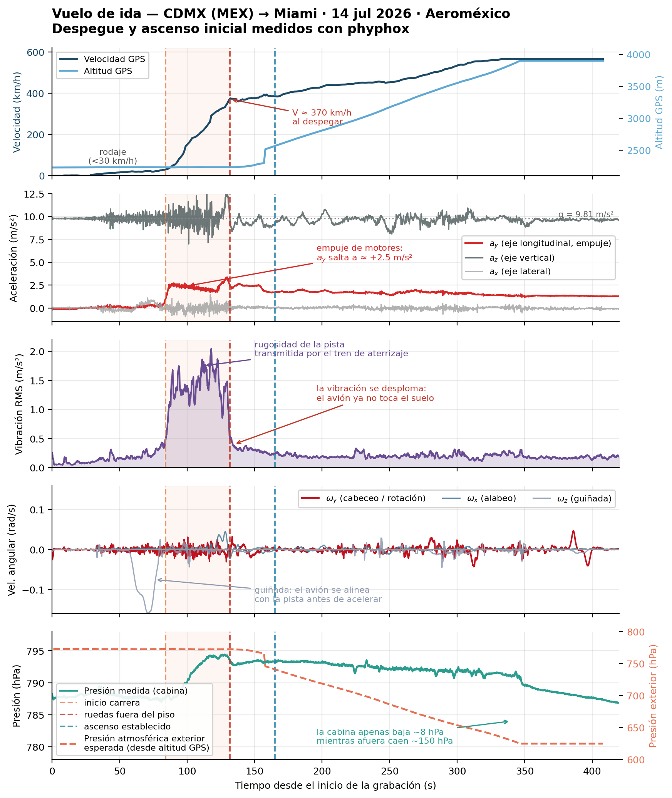
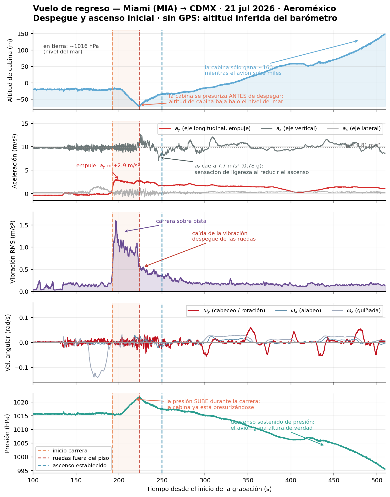
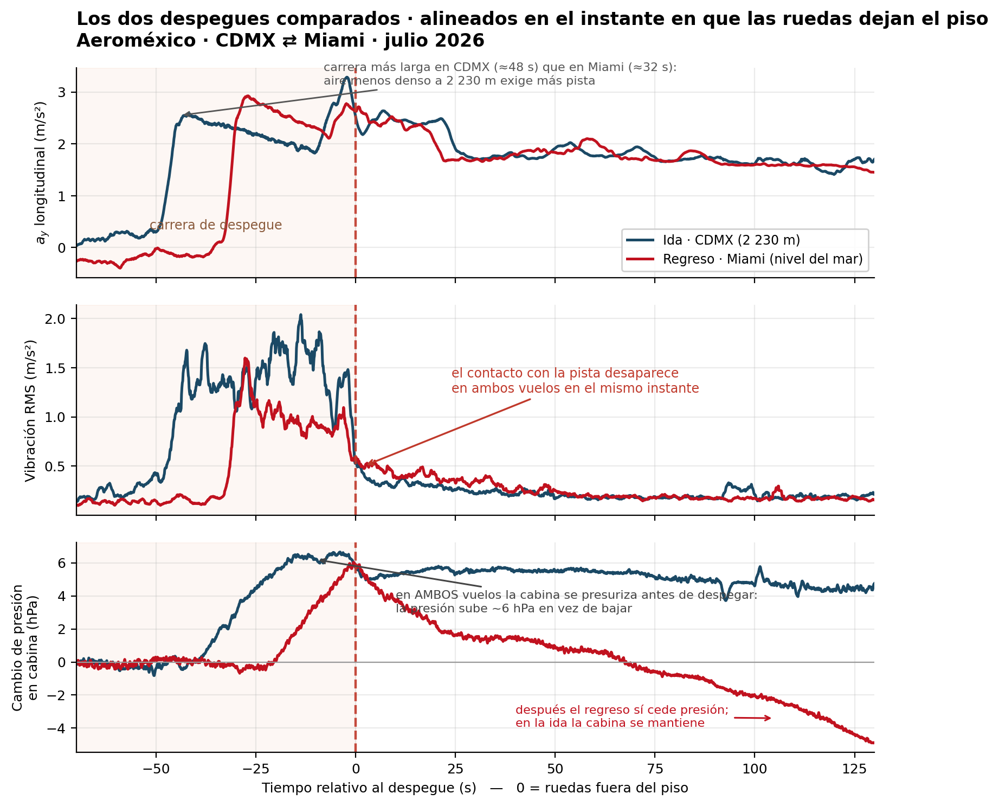

## Introducción

Hay gente que le tiene miedo a viajar en avión. No conozco las razones concretas de cada quien, pero puedo imaginarme al menos dos momentos que concentran esa incomodidad: el despegue y el aterrizaje. Ambos involucran una gran aceleración, una desaceleración y el hecho de despegarse del piso — sensaciones que difícilmente uno experimenta en su cotidianidad. Y justo ahí me llegaron las dudas sobre la cinemática de un avión durante esas dos maniobras. Este post trata solamente sobre el despegue.

Un avión comercial es un gran objeto de estudio de física. Tiene mucha ciencia e ingeniería detrás: desde cómo funcionan las turbinas y la física del vuelo, hasta los materiales con los que hay que construirlo para que resista todas las fuerzas a las que se expone. Acelera de cero a más de 300 km/h en menos de un minuto, se despega del suelo y sube varios kilómetros en cuestión de minutos. Todo eso es medible. Y resulta que un buen instrumento de medición, además accesible, es el teléfono: los celulares modernos traen acelerómetro, giroscopio, magnetómetro, barómetro y GPS.

La aplicación se llama phyphox. La usé en el laboratorio de mecánica durante la licenciatura, porque los instrumentos del laboratorio son analógicos y ya bastante viejos; ocupar el teléfono era una opción viable. Así que tenía la duda de qué tanto aguantaba la aplicación en una situación como esta, muy lejos de una mesa de laboratorio.

Antes de entrar a los datos conviene dejar claras las cantidades que van a aparecer y por qué cada una dice algo distinto.

### Velocidad y aceleración

La velocidades el cambio de posición en el tiempo, y es un vector; tiene magnitud, dirección y sentido. En este experimento el GPS la reporta directamente como rapidez sobre el suelo.  Durante el despegue la dirección es prácticamente constante, el avión va en línea recta por la pista, así que lo único que cambia es la magnitud.

La aceleración es el cambio de velocidad en el tiempo:

$$\vec{a} = \frac{d\vec{v}}{dt}$$

Si la curva de velocidad tiene pendiente pronunciada, la aceleración es grande; si la velocidad se aplana, la aceleración tiende a cero aunque el avión siga yendo rápido. Ir rápido y acelerar no son lo mismo, y esa distinción es justamente la que explica por qué el despegue se siente y el vuelo de crucero no, lo que el cuerpo percibe no es la velocidad, es el cambio de velocidad.

Un detalle importante del sensor, que confunde a mucha gente la primera vez. Un acelerómetro en reposo sobre una mesa no marca cero, marca 9.81 m/s² en el eje vertical. Lo que mide no es la aceleración respecto al suelo sino la fuerza por unidad de masa que actúa sobre él, incluida la reacción normal que lo sostiene contra la gravedad. Por eso en las gráficas el eje $z$ oscila alrededor de $g$ y no de cero, y por eso cuando $a_z$ baja de 9.81 sentimos ligereza en el estómago: no es que la gravedad haya cambiado, es que el piso nos está empujando con menos fuerza.

phyphox entrega dos canales distintos por esto mismo: la aceleración con gravedad (lo que el sensor mide crudo) y la aceleración lineal (con la gravedad ya restada por el sistema operativo). Aquí uso la primera, porque el término gravitatorio es información útil, no un estorbo.

### Desviación estándar: medir el temblor

La desviación estándar mide qué tanto se dispersan los valores de una señal alrededor de su promedio:

$$\sigma = \sqrt{\langle x^2 \rangle - \langle x \rangle^2}$$

Si todos los valores son casi iguales, $\sigma$ es pequeña; si oscilan mucho, $\sigma$ es grande. Es una medida de variabilidad, no de magnitud, y esa diferencia es la clave de todo el análisis.

La idea es la siguiente. El promedio de la aceleración me dice cuánto empuja el avión; la desviación estándar me dice cuánto tiembla. Son dos preguntas independientes, el avión puede empujar fuerte sin temblar (en el aire) o temblar mucho sin empujar (rodando despacio sobre pavimento irregular).

### Sustentación: por qué el avión se levanta

La fuerza que sostiene al avión en el aire es la sustentación, y depende de cuatro cosas:

$$L = \tfrac{1}{2}\,\rho\, v^2 S\, C_L$$

donde $\rho$ es la densidad del aire, $v$ la velocidad respecto al aire, $S$ la superficie del ala y $C_L$ el coeficiente de sustentación (que depende del ángulo de ataque y de la configuración de flaps).

Lo importante para este post está en los dos primeros factores. La sustentación crece con el cuadrado de la velocidad, así que duplicar la velocidad cuadruplica la fuerza que levanta al avión  por eso hay que correr por la pista antes de poder despegar. Y crece linealmente con la densidad del aire, que a su vez disminuye con la altitud.

### Presión, altitud y atmósfera estándar

La presión atmosférica disminuye con la altura porque arriba de uno hay menos columna de aire. La relación no es lineal, y el modelo estándar internacional (ISA) para la tropósfera da:

$$h = 44330 \left[ 1 - \left( \frac{p}{p_0} \right)^{1/5.255} \right]$$

con $p_0 = 1013.25$ hPa como presión de referencia a nivel del mar. Con esta fórmula, un barómetro se convierte en altímetro y de hecho así funcionan los altímetros de los aviones.

Aquí aparece el problema conceptual central del experimento, y vale la pena anticiparlo, esta fórmula convierte presión en altura, pero la altura que devuelve es la del lugar donde está el sensor. Si el sensor va dentro de una cabina presurizada, lo que se obtiene no es la altitud del avión sino la altitud de cabina, la altura a la que estaría uno si esa presión fuera la del aire libre. Son dos números distintos, y confundirlos es un error fácil de cometer.

Como referencia para leer las gráficas: al nivel del mar la presión ronda los 1013 hPa, en la Ciudad de México unos 780 hPa por sus 2 230 metros de altitud, y a la altitud de crucero típica de un vuelo comercial son unos 11 000 metros, apenas unos 225 hPa. Las cabinas se mantienen equivalentes a unos 2 000 metros como máximo, que es más o menos la presión de la Ciudad de México.

### Giroscopio: los giros del avión

El giroscopio mide velocidad angular, es decir qué tan rápido gira el teléfono alrededor de cada eje, en radianes por segundo. Los tres ejes corresponden a los tres movimientos de rotación de una aeronave: **cabeceo** (levantar o bajar el morro), **alabeo** (inclinar las alas) y **guiñada** (girar hacia los lados como un carro). Durante un despegue en línea recta estos valores deberían mantenerse cerca de cero.

## Metodología

### Los datos

Grabé con [phyphox](https://phyphox.org/) durante dos vuelos de Aeroméxico, ida y vuelta:

| | Vuelo de ida | Vuelo de regreso |
|---|---|---|
| Fecha | 14 de julio de 2026 | 21 de julio de 2026 |
| Ruta | CDMX (MEX) → Miami | Miami (MIA) → CDMX |
| Elevación de la pista | ≈ 2 230 m | ≈ 0 m (nivel del mar) |
| Duración grabada | 645 s | 782 s |
| GPS | Sí (360 puntos) | **No** |

El teléfono iba en la mano o sobre la mesita, sin fijación, con el experimento *Raw Sensors* de phyphox registrando todos los canales disponibles en paralelo.

### Sensores y frecuencias

| Sensor | Canales | Frecuencia |
|---|---|---|
| Acelerómetro (incluye gravedad) | $a_x$, $a_y$, $a_z$ | 500 Hz |
| Giroscopio | $\omega_x$, $\omega_y$, $\omega_z$ | 500 Hz |
| Aceleración lineal (sin gravedad) | $l_x$, $l_y$, $l_z$ | 100 Hz |
| Magnetómetro | $B_x$, $B_y$, $B_z$ | 100 Hz |
| Barómetro | presión | 10 Hz |
| GPS | lat, lon, altitud, velocidad, rumbo | 1 Hz |

El acelerómetro a 500 Hz es el canal clave, y no por la precisión del valor medio sino por el **ruido**: a esa frecuencia se puede medir cuánto vibra el avión, y ahí está escondido el momento del despegue.

### Cómo detecté el instante del despegue

Este es el truco central del análisis. La idea intuitiva sería buscar un cambio en la aceleración vertical, pero esa señal es ambigua: el avión rota el morro, acelera y sube todo al mismo tiempo, y $a_z$ se mueve por varias razones a la vez.

La señal limpia es otra. Mientras el avión rueda, las ruedas transmiten cada irregularidad del pavimento a la estructura, y de ahí al teléfono. En el momento en que el tren de aterrizaje deja de tocar el suelo, esa fuente de vibración **desaparece de golpe**. No se atenúa: se corta.

Para medirlo calculé la magnitud de la aceleración

$$|a| = \sqrt{a_x^2 + a_y^2 + a_z^2}$$

y luego, en ventanas de 0.1 s (50 muestras a 500 Hz), su desviación estándar:

$$\sigma_{\text{vib}} = \sqrt{\langle |a|^2 \rangle - \langle |a| \rangle^2}$$

Esto descarta el valor medio —que incluye la gravedad y el empuje— y deja sólo el temblor. El resultado es un detector de contacto con el suelo casi binario.

### Altitud a partir de la presión

Para convertir presión en altura usé la fórmula barométrica de la atmósfera estándar internacional (ISA):

$$h = 44330 \left[ 1 - \left( \frac{p}{p_0} \right)^{1/5.255} \right]$$

con $p_0 = 1013.25$ hPa. Como se verá, aplicar esto a los datos del teléfono da un resultado engañoso, y esa es justamente la parte interesante.

### Reproducibilidad

Todo el procesamiento está en Python (NumPy, SciPy, Matplotlib). Los archivos crudos fueron exportados de phyphox.

::: {.callout-warning}
## Dos problemas honestos con los datos

**1. La grabación tiene cortes ocultos.** phyphox pausa el reloj del experimento cuando la app se interrumpe, así que al reanudar el tiempo continúa como si nada. En los datos se ve como un salto físicamente imposible: en el vuelo de regreso, la presión cae 199 hPa en 0.2 s. Ningún avión hace eso. Detecté cortes en $t = 479$ s (ida) y $t = 515$ s (regreso), y corté todos los análisis antes de esos puntos. Esto lo hice ya que no queria medir todo, todo el tiempo, solo puntos importantes.

**2. El sensor de actitud está inservible.** Los canales de *pitch* y *roll* dan valores de hasta ±10 000°, probablemente porque el teléfono iba suelto en la mano y el filtro de orientación nunca convergió. No usé nada de ese sensor.
:::

## Resultados y Discusión 

### El vuelo de ida: CDMX → Miami

La secuencia se lee de arriba abajo:

- **$t = 0$–84 s** — Rodaje. Velocidad GPS bajo 30 km/h, vibración baja. En el giroscopio se ve un pico de guiñada alrededor de $t=76$ s: el avión girando para alinearse con la pista.
- **$t = 84$ s** — Empieza la carrera. $a_y$ salta de ~0.3 a **+2.5 m/s²** y se mantiene ahí. Son los motores a potencia de despegue.
- **$t = 131.6$ s** — Las ruedas dejan el piso. La vibración RMS se desploma de **2.0 a 0.35 m/s²**. La velocidad GPS en ese instante es de **371 km/h**.
- **$t \gtrsim 165$ s** — Ascenso establecido, a un promedio de **6.2 m/s (≈ 1 220 ft/min)**.

Al final del tramo limpio el avión está a **3 898 m** y **567 km/h**, habiendo ganado 1 657 m de altura en 267 s.

En la primera gráfica, se observa el comportamiento de la velocidad, cuando es menor a los 84 segundos, la velocidad es practicamente horizontal, no hay aumento en la velocidad practicamente tenemos velocidad constante tendiendo a cero, estos datos corresponden al avión preparandose para empezar el despegue. Del segundo 84 al 131, entre las lineas punteadas, notamos como la pendiente de la curva aumenta drásticamente, el avión pasó de 0 a 370 km/h en 47 segundos, desconozco la información de pilotaje, pero al menos de todo el despegue, estos 47 segundos es cuando lo motores usan la mayor cantidad de fuerza para lograr ese aumento de velocidad. Esta parte es el avión consiguendo la velocidad necesaria para lograr un buen despegue. A partir del segundo 131 a 165 es el avión ya sin las ruedas en el piso, aunque se nota como la velocidad deja de aumentar tanto, sigue aumentando, aproximadamente sube unos 40 km/h los primeros 34 segundos de despegue. Despues notamos como sube la velocidad hasta 600 km/h con más tiempo de por medio. Sigue aumentando su velocidad pero ya no se siente de manera brusca en el asiento. Recordando que la velocidad es un vector, si decimos que en este tiempo medido el avión sigue una linea recta, su dirección y sentido son las mismas, pero su magnitud es la que va cambiando entre los caso. Entre mas velocidad mas aumenta su magnitud llegando hasta los 600 km/h. La curva con un azul mas claro representa la altitud medida por el gps, pero notamos como la pista de despegue no tiene inclinación, y su acenso es practicamente un comportamiento lineal, constante. Es curioso comparar estas dos curvas, mientras el ascenso es constante, el mayor aumento de velocidad es al principio y va decayendo, significando que el avión ya no necesita tanto aumento de velocidad para subir. 

En física, la aceleración se define como el cambio de velocidad, por lo que la segunda gráfica se complementa con la primera, en la primera hablamos de como varió la velcidad con el tiempo, practicamente estabamos hablando de la aceleración. En la segunda gráfica observamos la aceleración en los 3 ejes. Como partimos del reposo, la aceleración en el eje x y en el eje y, son cero. Y en el eje z es la aceleración de la gravedad de la tierra. El empuje de los motores se nota como su mayor aumento es al arrancar, romper el estado de reposo. Después decae un poco y vuelve a acelerar coincidiendo con el evento del despegue, despues hay unas pequeñas perturbaciones para poder seguir subiendo, pero en tendencia decae ligeramente y encuentra valores constantes. Los valores de la aceleración en x son practicamente ruido y movimientos en la aceleración principal. Tambien hay puntos importantes, hay demasiado ruido antes del despegue, ya que como vimos, la aceleración que experimentamos tan fuerte, hace que el avión sufra estres sobre su cuerpo. Pero justo en el evento de despegue se observa como aumenta y descae rapidamente, recuerden que la aceleración en z representa nuestra sensación de gravedad, por lo que desde el evento de despegue y hasta lo 350 segundos, vamos a tener las sensaciónes de como si nos jalara el asiento o nos levantaramos, o el mas evidente el sentimiento en el estomago. 

La tercera gráfica es el ruido que se mete por las irregularidades de la pavimentación y los movimientos del tren de aterrizaje. Se nota como en la aceleración principal, es cuando los valores de vibración aumentan de manera destacable. Pero fuera de esa región, practicmanete es ruido que mete el sensor en el teléfono, ya que podemos observar los mismos valores cuando estamos parados, que cuando estamos en el aire, por eso podemos asegurar el punto exacto de inicio de aceleración y el despegue. Dado la vibración del teléfono. 

La cuarta gráfica, representa los movimientos del avión. Si el avión hiciera vueltas, giros, etc. Se notaria en estas gráficas. Pero dado que el despegue es practicamente en linea recta, los valores se mantienen alrededor del cero. Unicamente se observa una vuelta que dio el avión para acomodarse en el tren de aterrizaje. 

La última gráfica, nos dice como se presuriza la cabina del avión y la presurización atmosférica. Al aumentar altura vemos como decae la presión atmosferica y la de la cabina mantiene sus valores para que no sea un peligro para nosotros, los que vamos arriba de un avión. 

### El vuelo de regreso: Miami → CDMX

Misma estructura, sin GPS. Aquí el panel de $a_z$ hace el trabajo que en el otro vuelo hacía la velocidad:

- **$t = 192$ s** — Inicio de la carrera, con $a_y$ llegando a **+2.9 m/s²**.
- **$t = 224$ s** — Despegue. La carrera duró apenas **32 s**.
- **$t \approx 247$ s** — $a_z$ cae a **7.66 m/s² = 0.78 g**. Esa es, literalmente, la sensación de ligereza en el estómago cuando el avión reduce el ritmo de ascenso tras el empujón inicial.

En las 5 gráficas notamos practicamente el mismo comportamiento que con el primero vuelo. Aunque con sus pocas diferencias dado el cambio de condiciones. La primera gráfica en este caso no hubo oportunidad de medir la velocidad por medio de GPS, aunque si mide la altitud. El cambio de condiciones en este caso, es que el vuelo ahora empezo al nivel del mar. Por lo que presuriza la cabina en el momento del despegue y sube hasta 160 metros. Los datos de altura son extraños, ya que el avión sube más, es por los sensores del teléfono, que el teléfono esta dentro de la cabina y mide la presión de la cabina. Al no tener GPS, estos valores salieron del sensor de presión. 

La gráfica de aceleración es practicamente la misma forma que comentamos en el primer vuelo, en este caso la aceleración incial es un poco mayor. Las siguentes 2 gráficas, tiene el mismo comportamiento, es algo que se esperaba, estas 2 gráficas no dicen que las mediciones son reproducibles, nos da valides y nos dice lo estándar de un despegue de avión comercial de ese tipo. Aunque por expriencia en el vuelo, la cuarta gráfica se ve asi en la parte del ascenso, cuando el avión ya está en el aire, ya que el despegue es hacia el norte y tiene que dar la vuelta para ir en dirección de México. 

La ultima gráfica nos dice que partimos de la presurización a nivel del mar y conforme aumentamos la altitud, llega a los valores minimos permitidos para nuestra salud, es un decaimiento constante, ya que no puede ser muy rápido, ya que puede causar problemas en cierto tipo de personas. Esta presión, recordando es la de la cabina, ya que la presión atmosferica debe de bajar los valores aún mas por la altura en la que llega el avión. 

### La comparación

Poner los dos vuelos en el mismo eje, con el origen en el despegue, hace visible lo que ninguna gráfica individual nos decía. La carrera de despegue en CDMX duró 48 s; la de Miami, 32 s. Un 50 % más de tiempo sobre la pista para el mismo tipo de operación. Esto es por la diferencia de altura entre CDMX y Miami, la sustentación depende de la densidad del aire, por lo que:

$$L = \tfrac{1}{2}\,\rho\, v^2 S\, C_L$$

A 2 230 m de altura (CDMX) la densidad del aire es aproximadamente un 20 % menor que a nivel del mar. Con menos $\rho$, el avión necesita más $v$ para generar la misma $L$, y llegar a esa velocidad mayor exige más pista y más tiempo. El aeropuerto de la Ciudad de México, la altitud penaliza tanto la sustentación como el empuje de los motores.

Durante el ascenso desde CDMX, el GPS registra una subida real de 2 229 a 3 898 m. La presión atmosférica exterior, a esas altitudes, debería caer de unos 780 a unos 630 hPa, una caída de ~150 hPa. Pero el barómetro del teléfono registró una caída de 8 hPa. No es un error del sensor. El barómetro está funcionando perfectamente, como ya comente, no está midiendo la atmósfera, está midiendo la cabina. El sistema de presurización del avión mantiene el interior a una presión mucho mayor que la exterior, y el teléfono, que va adentro, sólo puede medir lo de adentro. Como se ve en las gráficas mientras el avión subía 1 669 m reales, la cabina "subió" unos 90 m.

Hay un segundo detalle, que aparece en los dos vuelos, la presión de cabina sube ~6 hPa durante la carrera de despegue, antes de que el avión se despegue del suelo. El sistema empieza a presurizar en tierra, de modo que la cabina arranca ligeramente por encima de la presión ambiente. En la gráfica de Miami esto se ve como una altitud de cabina que baja por debajo del nivel del mar justo antes del despegue.

El resultado más sólido del análisis viene de tirar la información y quedarse con el ruido. La desviación estándar del acelerómetro no depende de la orientación del teléfono, ni de si el avión está acelerando, ni de la gravedad, sólo de si hay o no una fuente de vibración mecánica acoplada. Como el contacto rueda-pavimento es esa fuente, y desaparece de forma discreta, el detector es casi ideal. Es un buen ejemplo de que la parte "sucia" de una señal a veces contiene el dato más limpio.

Vale la pena ser explícito sobre lo que este experimento no puede afirmar

- **El teléfono no estaba fijo.** Los ejes $x$, $y$, $z$ no coinciden con los ejes del avión, y esa relación pudo cambiar durante el vuelo. Los valores de $a_y$ como "eje longitudinal" son una aproximación razonable durante el despegue —cuando el teléfono estuvo quieto— pero no una calibración.
- **La altitud GPS tiene error propio**, típicamente peor que la horizontal, y la serie tiene huecos (uno de 93 s).
- **$n = 2$.** Dos vuelos no permiten separar el efecto de la altitud del aeropuerto de otras variables: modelo de avión, peso al despegue, temperatura, viento, procedimiento del piloto. La explicación por densidad del aire es física y sólida, pero estos datos son *consistentes* con ella, no una demostración.
- **Las tasas de ascenso** están calculadas sobre muestras GPS contiguas para evitar artefactos de los huecos; hacerlo ingenuamente daba valores absurdos de 8 000 ft/min.

## Conclusiones

Empecé este experimento preguntandome que mediría Phyphox en el vuelo de un avión y que podemos aprender de eso. La parte fácil resultó ser el instante exacto en que las ruedas dejan el piso queda registrado con precisión de décimas de segundo, y no en la señal más obvia. La aceleración vertical es ambigua porque el avión rota, acelera y sube al mismo tiempo; la vibración, en cambio, no admite interpretaciones. Mientras hay contacto con el pavimento hay temblor, y cuando el contacto termina el temblor se corta de golpe, de 2.0 a 0.35 m/s². Que el dato más limpio del análisis venga de la parte que normalmente se descarta como ruido es, creo, la lección metodológica que me llevo.

La comparación entre los dos aeropuertos confirmó algo que la física predice, despegar a 2 230 metros cuesta un 50 % más de carrera que hacerlo a nivel del mar, 48 segundos contra 32. Con una densidad del aire aproximadamente un 20 % menor, el avión necesita alcanzar una velocidad mayor para generar la misma sustentación, y llegar a esa velocidad exige más pista y más tiempo. Conviene ser honesto sobre el alcance de esta afirmación, con dos vuelos no puedo aislar la altitud del resto de las variables, peso, modelo, temperatura, viento, criterio del piloto, así que lo correcto es decir que los datos son consistentes con la explicación por densidad, no que la demuestran.

## Referencias

- Staacks, S., Hütz, S., Heinke, H., & Stampfer, C. (2018). Advanced tools for smartphone-based experiments: phyphox. *Physics Education*, 53(4), 045009.
- Organización de Aviación Civil Internacional (1993). *Manual of the ICAO Standard Atmosphere* (Doc 7488), 3.ª ed.
- Anderson, J. D. (2016). *Introduction to Flight*, 8.ª ed. McGraw-Hill. — capítulos sobre sustentación y rendimiento en despegue.
- Administración Federal de Aviación de EE. UU. (2016). *Pilot's Handbook of Aeronautical Knowledge* (FAA-H-8083-25B). — efectos de la altitud de densidad.
- Documentación de phyphox sobre el experimento *Raw Sensors*: <https://phyphox.org/sensordb/>

---

::: {.callout-tip}
## Reproduce esto tú mismo
Sólo hace falta la app phyphox, un asiento con ventanilla y acordarse de darle *play* antes del rodaje. Si haces la medición en un aeropuerto a distinta altitud, me interesaría comparar datos.
:::
